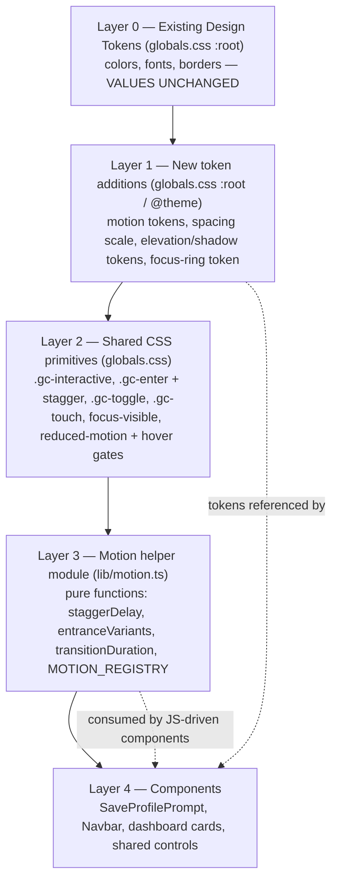
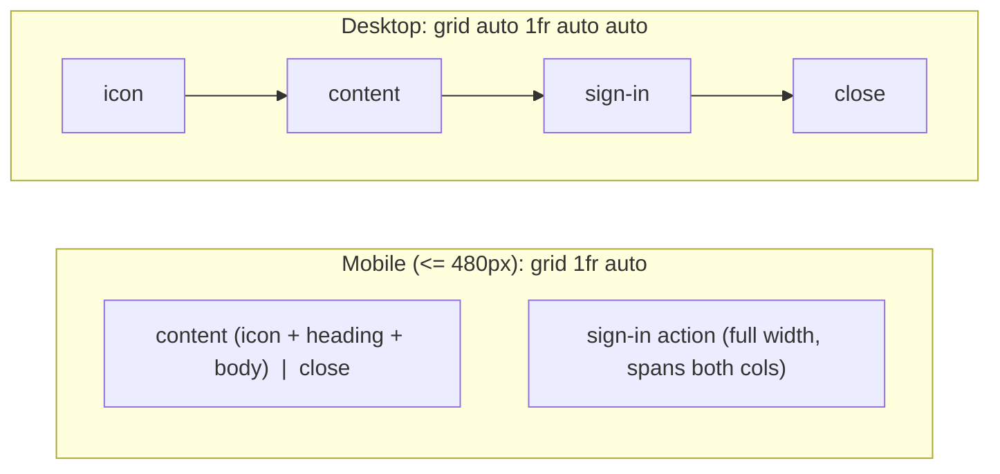
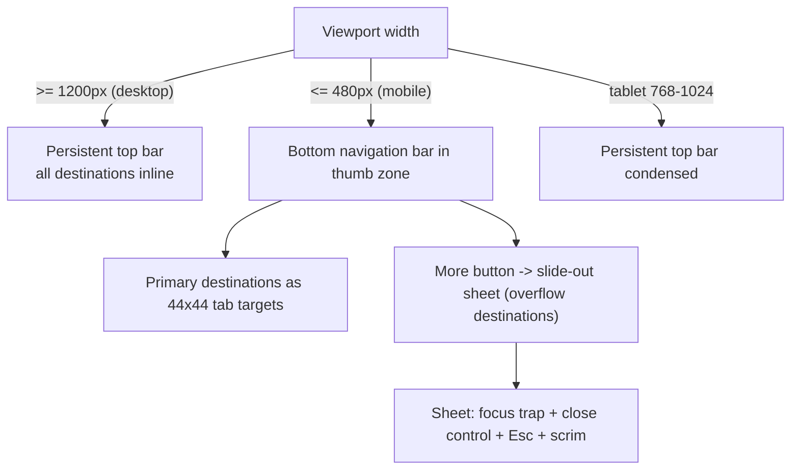

# Design Document: UI/UX Overhaul

## Overview

This design describes a presentation-and-interaction-only overhaul of the GutCheck web app. It introduces a cohesive **motion + design-token layer** that sits on top of the existing warm-minimalist design system in `app/globals.css`, fixes the `SaveProfilePrompt` banner overlap bug, makes navigation thumb-reachable on mobile, standardizes interactive controls and focus states, and adds staggered entrance animations — all while preserving the established palette, typography, and "anti-AI" aesthetic.

The work changes **presentation, layout, motion, and responsiveness only**. No data models, business logic, store shape, API routes, or feature behavior change. Every color and font continues to flow from the existing Design_Tokens; no new hue families, bright gradients, or heavy shadows are introduced.

The motion language follows Emil Kowalski's design-engineering principles: animate only `transform`/`opacity`, use a strong custom ease-out curve `cubic-bezier(0.23, 1, 0.32, 1)`, keep state transitions in the 150–200ms band, apply `scale(0.97)` on press, stagger collection entrances by 30–80ms, prefer `@starting-style`/`data-mounted` entrance patterns, and gate motion behind `prefers-reduced-motion` and `@media (hover: hover) and (pointer: fine)`.

### Critical version constraint (must read before coding)

This repository pins **Next.js 16.2.4** and **React 19.2.4**, and `AGENTS.md` warns that this Next.js has breaking changes relative to common knowledge. **Before writing any implementation code, the implementer MUST read the relevant guides under `node_modules/next/dist/docs/` and honor any deprecation notices.** Specifically:

- `node_modules/next/dist/docs/index.md` — entry point and AI-agent hints. Note the explicit hint: client-side navigation correctness may require exporting `unstable_instant` from a route (see `docs/01-app/02-guides/instant-navigation.mdx`). Because this overhaul touches navigation and perceived-performance, confirm the current route-transition conventions there before changing nav.
- `node_modules/next/dist/docs/01-app/` — App Router conventions (`layout.tsx`, `'use client'` boundaries, metadata/`viewport` export rules). This project uses the App Router; `app/layout.tsx` and per-route `page.tsx` must follow this version's conventions.
- Tailwind CSS v4 is used **CSS-first** (`@import "tailwindcss";` in `globals.css`, no `tailwind.config.js`). Any new tokens/utilities are declared in CSS via `@theme`/custom properties, not a JS config. Confirm Tailwind v4 conventions before adding utilities.

The implementer MUST treat the docs in `node_modules/next/dist/docs/` as the source of truth for framework APIs, overriding prior training assumptions.

## Architecture

### Layered design + motion system

The system is organized as additive layers over the existing stylesheet. Lower layers never change; higher layers consume the layer beneath them.



**Design principle: CSS-first, JS-reserved.** Predetermined, interruptible, hardware-accelerated UI (hover, press, focus, card entrance) is driven by **CSS transitions and `@starting-style`** so it runs off the main thread and never drops frames during Next.js route transitions (the documented failure mode of `requestAnimationFrame`-based libraries under navigation load). JavaScript animation (framer-motion) is **reserved** for the one genuinely dynamic, exit-animated, interruptible surface: the mobile navigation sheet.

### How the motion layer overlays globals.css

- **Layer 1** appends a `@theme`/`:root` block to `globals.css` with motion tokens and a spacing scale. It adds nothing that overrides existing color/font tokens.
- **Layer 2** adds reusable classes to `globals.css`. The existing `.gc-card`, `.gc-btn-primary`, `.gc-btn-secondary`, `.gc-input`, and `:focus-visible` rules are extended in place (transitions tightened to `transform`/`opacity`, press scale added) rather than duplicated.
- **Layer 3** (`lib/motion.ts`) is a small pure-TypeScript module. It is the single source of truth for numeric motion values, so both CSS (via inline custom properties like `--gc-stagger-index`) and any JS-driven component read the same definitions. It has **no DOM or React dependency**, which makes it unit/property testable in isolation.

### Token additions (Layer 1)

Added to `:root` in `globals.css` (values chosen to satisfy the requirements' numeric bounds):

```css
:root {
  /* Motion — easing */
  --ease-out:    cubic-bezier(0.23, 1, 0.32, 1);   /* state transitions, entrances */
  --ease-in-out: cubic-bezier(0.77, 0, 0.175, 1);  /* on-screen movement */
  --ease-drawer: cubic-bezier(0.32, 0.72, 0, 1);   /* mobile nav sheet */

  /* Motion — duration (state transitions land in the 150–200ms band) */
  --dur-press:  120ms;   /* press feedback only */
  --dur-state:  180ms;   /* hover / focus / active color+transform */
  --dur-enter:  320ms;   /* entrance (not a "state transition" per req 6.2) */

  /* Motion — primitives */
  --press-scale: 0.97;
  --stagger-step: 60ms;  /* within 30–80ms; clamped in lib/motion.ts */
  --stagger-max-index: 8; /* cap so long lists never feel slow */
  --enter-offset: 8px;   /* fade-in-up vertical offset */

  /* Spacing scale (single source for layout rhythm) */
  --space-1: 0.25rem; --space-2: 0.5rem; --space-3: 0.75rem;
  --space-4: 1rem;    --space-6: 1.5rem; --space-8: 2rem; --space-12: 3rem;

  /* Elevation — bounded: max blur 12px, max opacity 0.12 (req 1.4) */
  --shadow-sm: 0 1px 3px rgba(28, 26, 23, 0.06);
  --shadow-md: 0 4px 12px rgba(28, 26, 23, 0.10);

  /* Focus ring — darkened sage for >= 3:1 contrast on warm surfaces (req 5.3) */
  --focus-ring: #2F5A3A;
}
```

Note: `--dur-state` (180ms) is the value used for all hover/focus/active transitions, satisfying the 150–200ms requirement. `--dur-enter` governs entrance animations, which the requirements scope separately (req 7) and do not bind to the 150–200ms state-transition band.

### Global motion gates (Layer 2)

Two media queries wrap all motion, applied once in `globals.css`:

```css
/* Hover effects only on true fine-pointer devices (req 8.4, 8.5) */
@media (hover: hover) and (pointer: fine) {
  .gc-interactive:hover { transform: translateY(-1px); }
}

/* Reduced motion: entrances become opacity-only; hover/press motion removed (req 8.1, 8.2, 8.3) */
@media (prefers-reduced-motion: reduce) {
  .gc-interactive, .gc-interactive:active, .gc-interactive:hover { transform: none; }
  .gc-enter { transform: none; transition: opacity var(--dur-enter) var(--ease-out); }
  .gc-enter[data-mounted="false"] { transform: none; opacity: 0; }
}
```

## Components and Interfaces

### 1. Motion helper module — `lib/motion.ts` (new)

Pure functions and a registry; no React/DOM. This is the PBT surface.

```ts
export type InteractionKind = 'hover' | 'focus' | 'active' | 'press';
export interface EntranceVariant {
  fromOpacity: number;   // < 1
  toOpacity: number;     // === 1
  fromOffsetPx: number;  // vertical offset; 0 when reduced motion
  toOffsetPx: number;    // === 0
}

/** Per-item entrance delay in ms; clamped so consecutive deltas stay in [30,80]
 *  and the total never exceeds the cap (long lists never feel slow). */
export function staggerDelay(index: number, stepMs?: number, maxIndex?: number): number;

/** Duration (ms) for a state transition; always within [150,200]. */
export function transitionDuration(kind: InteractionKind): number;

/** Entrance variant. When prefersReducedMotion, offset is 0 (opacity-only). */
export function entranceVariants(prefersReducedMotion: boolean): EntranceVariant;

/** Registry of every animation this app performs, used to prove only
 *  transform/opacity are animated (req 6.1, 6.5). */
export const MOTION_REGISTRY: ReadonlyArray<{
  name: string;
  animatedProperties: ReadonlyArray<'transform' | 'opacity'>;
}>;
```

### 2. `SaveProfilePrompt` — banner overlap fix

The current bug: the dismiss control is `position: absolute; top-2 right-2`, so on narrow/`flex-col` layouts it overlaps the heading/body text, and the full-width sign-in button can collide with it.

**Fix — CSS Grid with a reserved dismiss track.** The dismiss control becomes a normal grid cell occupying its own track; grid tracks never overlap by construction, so the dismiss control, the text content, and the sign-in action are guaranteed non-overlapping at every width.



Layout contract:
- Container: `display: grid` with named areas. Mobile `grid-template-columns: 1fr auto` / areas `"content close"` then `"action action"`. From `md` up: `grid-template-columns: auto 1fr auto auto` / areas `"icon content action close"`.
- The `close` cell is an `auto` track sized to the 44×44 dismiss target. The `content` cell gets `min-width: 0` and `padding-inline-end: var(--space-2)` as defense-in-depth, but non-overlap does not depend on it — separate tracks already guarantee it.
- Dismiss control: `.gc-touch` (min 44×44), `aria-label="Dismiss save profile prompt"` (accessible name retained, req 4.8).
- Sign-in: `.gc-btn-primary` consuming `--tl-prioritize` via the existing token; `onClick={() => signIn('google')}` unchanged (req 4.7).
- Dismiss behavior unchanged (`setDismissed(true)`, req 4.6).
- Entrance: replace the framer-motion `motion.div` with the CSS `.gc-enter` pattern (`@starting-style`/`data-mounted`) — opacity + small translate, reduced-motion aware. Exit-on-dismiss is a simple unmount (no exit animation needed), removing this component's framer-motion dependency.

### 3. Navigation — `Navbar.tsx` (responsive)

Requirement 11 wants a **thumb-zone-reachable** primary control on mobile and a **persistent** bar on desktop, with the same destinations everywhere and a focus-trapped, closeable sheet.



Design decisions:
- **Desktop / tablet:** keep the persistent top bar (req 11.2). It already renders all destinations and is unchanged in structure.
- **Mobile:** introduce a **fixed bottom navigation bar** anchored in the Thumb_Zone (`position: fixed; bottom: 0; padding-bottom: env(safe-area-inset-bottom)`). Because there are six destinations (`Dashboard, Scan Menu, Groceries, Chef's Card, History, Profile`) — more than a bottom bar shows legibly — the bar shows the most-used destinations plus a **"More"** control that opens the existing slide-out sheet for overflow. The sheet retains the current `useFocusTrap` integration, Escape handling, scrim, and close button (req 11.4). All six destinations remain reachable on every breakpoint (req 11.5).
- The current top-right hamburger trigger is **moved into the thumb zone** (it becomes the bottom bar's "More" control), satisfying req 11.1's thumb-reachability.
- The bottom bar adds bottom padding to page content (`main`) on mobile so it never occludes content.
- Sheet animation stays on **framer-motion** (`AnimatePresence` + `motion.aside`) — this is the justified JS reservation: it needs enter **and exit** animation on unmount and is interruptible. Its easing uses `--ease-drawer`'s curve `[0.32, 0.72, 0, 1]` (already in place).
- Active-route detection via `usePathname()` is unchanged. Confirm `usePathname`/`Link` conventions against `node_modules/next/dist/docs/01-app/` for this version before editing.

### 4. Shared interactive controls (globals.css)

- **Buttons** (`.gc-btn-primary`, `.gc-btn-secondary`): tighten `transition` to `transform var(--dur-state) var(--ease-out), background-color var(--dur-state) var(--ease-out)`; add `:active { transform: scale(var(--press-scale)); }`. Replace the current `translateY` hover so motion is gated by the hover media query via the `.gc-interactive` mixin class.
- **Inputs** (`.gc-input`): keep token-based border/background; focus uses the ring described below.
- **Toggle** (`.gc-toggle`, new): a switch whose on/off state is conveyed by **both color and a non-color cue** — knob position plus a small inline glyph (`✓` on / `✕` off) or an `aria-checked`-driven icon (req 5.5). Built as a styled `button[role="switch"]`.
- **Focus state** (`:focus-visible`): outline `2px solid var(--focus-ring)` with `outline-offset: 2px`. `--focus-ring` (`#2F5A3A`) is darkened to clear **3:1 contrast** against warm surfaces (`--bg-primary #FAF8F4`, `--bg-elevated #FFFFFF`, `--bg-secondary #F3EFE8`) (req 5.3, 5.4). Outline (not box-shadow alone) is used so the ring is unaffected by overflow clipping; minor sub-pixel shift is acceptable per req 5.4.
- **Touch target** (`.gc-touch`, new): `min-height: 44px; min-width: 44px; display: inline-flex; align-items: center; justify-content: center;` plus an optional `::before` hit-area expander for visually-small icons (req 10.1–10.3). Adjacent targets use `gap >= var(--space-2)` so 44px hit areas don't overlap (req 10.4).

### 5. Staggered entrance — dashboard cards/lists

A CSS-driven mechanism, no per-component JS:

```css
.gc-enter {
  opacity: 1; transform: translateY(0);
  transition: opacity var(--dur-enter) var(--ease-out),
              transform var(--dur-enter) var(--ease-out);
  transition-delay: calc(var(--gc-stagger-index, 0) * var(--stagger-step));
}
@starting-style {
  .gc-enter { opacity: 0; transform: translateY(var(--enter-offset)); }
}
/* Fallback where @starting-style is unsupported */
.gc-enter[data-mounted="false"] { opacity: 0; transform: translateY(var(--enter-offset)); }
```

Each card sets `style={{ '--gc-stagger-index': i }}`, where `i` is clamped via `staggerDelay`'s index cap. The Dashboard wraps quick-action cards, marker cards, and trend cards with `.gc-enter`. This produces fade-in-up with a 60ms cascade (req 7.1–7.4), collapses to opacity-only under reduced motion, and lands at full opacity / final position when complete.

### 6. `PageTransition.tsx` and `AppShell.tsx`

- `PageTransition` currently uses framer-motion with `ease: 'easeOut'` over 0.4s. Re-evaluate against the documented "CSS animations beat JS under load" guidance: prefer a CSS `.gc-enter`-style transition for the page wrapper so route transitions don't drop frames. If framer-motion is retained here, switch its easing to the custom `--ease-out` curve and use a `transform` string for hardware acceleration. **Before changing route-transition behavior, read `docs/01-app/02-guides/instant-navigation.mdx`** — this version may require `unstable_instant` for instant client navigation, which interacts with how/when the wrapper animates.
- `AppShell` adds the mobile bottom-nav and the content bottom-padding offset; structure otherwise unchanged.

## Data Models

This feature introduces **no application data model changes**. The store (`gutcheck.store`), health-profile types, report history, and all API contracts are untouched (per requirements: presentation/motion/layout/responsiveness only).

The only new "models" are presentation-layer constructs in `lib/motion.ts`:

```ts
type InteractionKind = 'hover' | 'focus' | 'active' | 'press';

interface EntranceVariant {
  fromOpacity: number;   // invariant: 0 <= fromOpacity < 1
  toOpacity: number;     // invariant: === 1
  fromOffsetPx: number;  // invariant: >= 0; === 0 when reduced motion
  toOffsetPx: number;    // invariant: === 0
}

interface MotionRegistryEntry {
  name: string;
  animatedProperties: ReadonlyArray<'transform' | 'opacity'>; // closed set
}
```

The existing navigation destination list (`NAV_LINKS` in `Navbar.tsx`) is reused as-is and remains the single source of destinations across all breakpoints.

## Correctness Properties

*A property is a characteristic or behavior that should hold true across all valid executions of a system — essentially, a formal statement about what the system should do. Properties serve as the bridge between human-readable specifications and machine-verifiable correctness guarantees.*

Most of this overhaul is visual, layout, and responsive behavior that has no meaningful "for all inputs" statement and cannot be measured without a real layout engine. Those criteria are covered by example, integration (real-browser), and visual tests in the Testing Strategy, not by properties. The genuinely property-testable surface is the **pure motion-helper layer (`lib/motion.ts`)** plus the **WCAG contrast helper** — pure functions whose behavior varies with input and that benefit from 100+ generated iterations. The properties below were consolidated during prework reflection to remove redundancy (the three fade-in-up criteria collapse to one entrance-variant property; the two reduced-motion criteria collapse to one; the two "only transform/opacity" criteria collapse to one registry property).

### Property 1: Only `transform` and `opacity` are ever animated

*For all* entries in `MOTION_REGISTRY` (and for any generated registry entry the app could add), the set of animated CSS properties is a subset of `{ "transform", "opacity" }`.

**Validates: Requirements 6.1, 6.5**

### Property 2: State-transition durations stay within the 150–200ms band

*For all* `InteractionKind` values (`hover`, `focus`, `active`, `press`), `transitionDuration(kind)` returns a value `d` with `150 <= d <= 200`.

**Validates: Requirements 6.2**

### Property 3: Stagger delays cascade by 30–80ms and never run away

*For all* non-negative integer indices `i`, `staggerDelay(i)` is non-decreasing, the delta `staggerDelay(i+1) - staggerDelay(i)` is either `0` (once the index cap is reached) or within `[30, 80]` ms, and `staggerDelay(i)` never exceeds the configured maximum (`stagger-step * stagger-max-index`).

**Validates: Requirements 7.2**

### Property 4: Normal-mode entrance is a fade-in-up with a settled terminal state

*For all* invocations of `entranceVariants(false)`, the result satisfies `0 <= fromOpacity < 1`, `toOpacity === 1`, `fromOffsetPx > 0`, and `toOffsetPx === 0` — i.e. each item begins lower and translucent and ends at full opacity in its final position.

**Validates: Requirements 7.1, 7.3, 7.4**

### Property 5: Reduced-motion entrance is opacity-only

*For all* invocations of `entranceVariants(true)`, there is no positional movement (`fromOffsetPx === 0` and `toOffsetPx === 0`) while opacity still rises (`fromOpacity < 1` and `toOpacity === 1`).

**Validates: Requirements 8.1, 8.2**

### Property 6: Focus ring meets 3:1 contrast against every surface

*For all* background surface tokens in the warm palette (`--bg-primary`, `--bg-secondary`, `--bg-elevated`, and the muted tint backgrounds such as `--tl-prioritize-bg`), the WCAG contrast ratio between `--focus-ring` and the surface is `>= 3.0`.

**Validates: Requirements 5.3**

## Error Handling

This is a presentation-layer change with little runtime branching, but the following resilience rules apply:

- **Progressive enhancement for `@starting-style`.** Entrance animations use `@starting-style` where supported and fall back to the `data-mounted` attribute pattern otherwise. If neither path runs (e.g., JS disabled and old engine), content MUST render at full opacity and final position rather than stuck hidden — the base `.gc-enter` rule defines the settled state, and the hidden state is the override, so the default is "visible."
- **Reduced-motion / no-pointer environments.** Motion gates are pure CSS media queries; if `matchMedia` is unavailable in JS contexts, no JS reads it for layout decisions, so there is no failure path — CSS resolves the correct branch.
- **Mobile sheet focus trap.** The existing `useFocusTrap` already restores focus on close and no-ops when there are zero focusable elements; the bottom-nav "More" trigger must remain focusable so focus can return to it on sheet close.
- **Banner with missing session provider.** `SaveProfilePrompt` returns `null` when a session exists or when dismissed; these guards are preserved so the banner never renders for signed-in users.
- **Token absence.** All new components reference tokens via `var(--token)`; if a token is undefined, components fall back to inherited/initial values rather than crashing. Tests assert tokens are defined.
- **Next.js version pitfalls.** Because framework APIs may differ in 16.2.4, any error arising from navigation or layout conventions MUST be resolved by consulting `node_modules/next/dist/docs/` (not by reverting to assumed older-version APIs). In particular, if client navigations feel slow after the overhaul, check the `unstable_instant` route-export guidance rather than adding JS animation workarounds.

## Testing Strategy

A layered strategy matches the layered architecture: pure logic gets property tests, components get example tests, and geometry/responsiveness gets real-browser tests.

### Dual approach

- **Property-based tests** (universal correctness of `lib/motion.ts` + contrast helper) — see below.
- **Example/component tests** (concrete behavior, a11y, structure) using the existing Vitest setup with a React Testing Library + jsdom environment.
- **Integration / visual-responsive tests** (geometry, overlap, touch targets, no-horizontal-scroll, column counts) in a real browser engine — jsdom cannot measure layout.

### Property-based testing

PBT **is** appropriate for the pure motion/contrast helpers and is used there. PBT is **not** appropriate for the layout, overlap, responsive, and visual-aesthetic criteria, which dominate this feature — those use example and real-browser tests instead.

- **Library:** `fast-check` (the standard property-based testing library for the TS/Vitest ecosystem). It is the only new dev dependency proposed; it integrates directly with Vitest and adds no runtime footprint. Do **not** hand-roll generators.
- **Iterations:** configure each property test for a minimum of **100 runs** (`fc.assert(..., { numRuns: 100 })`).
- **Tagging:** each property test is tagged with a comment of the form `// Feature: ui-ux-overhaul, Property {n}: {property text}` and maps 1:1 to a property above (Properties 1–6 → six property tests).
- **Generators:** Property 3 generates arbitrary non-negative indices (including large values to exercise the cap); Properties 4–5 are exhaustive on the boolean input but run through `fc` for uniformity; Property 6 generates colors within the warm-palette family plus the fixed surface-token set to ensure the ring clears 3:1 across the whole family, not just listed tokens.

### Example / component tests (Vitest + Testing Library + jsdom)

- `SaveProfilePrompt`: dismiss removes the banner (4.6); sign-in calls mocked `signIn('google')` (4.7); dismiss control exposes its accessible name (4.8); grid layout classes/areas present (structural support for 4.1–4.5).
- `Navbar`: destination set equals `NAV_LINKS` at representative widths (3.4, 11.5); each destination links to the correct route (11.3); sheet open renders a close control and traps focus via `useFocusTrap` (11.4); thumb-zone control renders at mobile width and persistent bar at desktop width (11.1, 11.2).
- Shared controls: buttons map to `gc-btn-primary`/`gc-btn-secondary` (5.1, 5.2); `:focus-visible`/active rules use `outline` and `scale(0.97)` (5.4, 6.4); toggle exposes a non-color cue (`aria-checked` + glyph/position) in both states (5.5).
- Token/guardrail checks: `--shadow-*` tokens parse to blur `<= 12px` and alpha `<= 0.12` (1.4); components reference `var(--font-*)`/`var(--…)` rather than raw hex or literal font families (1.1–1.3, 1.5); no gradient declarations in component styles (1.6); spacing scale is defined and used (2.1); one primary display-font heading per page (2.2); information-field presence preserved per page (2.5, 9.6); primary pages share the max-width + centering wrapper (3.3).
- Motion gating (CSS-structure assertions): hover rules are nested inside `@media (hover: hover) and (pointer: fine)` (8.4, 8.5); reduced-motion block zeroes transforms while keeping controls operable (8.1, 8.3).

### Integration / visual-responsive tests (real browser)

Run in a headless browser (Playwright recommended; reuses the dev server) across the three viewport bands (mobile 320–480, tablet 768–1024, desktop ≥1200):

- **Banner non-overlap (4.1–4.5):** measure `getBoundingClientRect()` of the dismiss control, the sign-in action, and the heading/body text; assert no pairwise rectangle intersection at all three bands.
- **No horizontal scroll (9.1–9.3):** assert `documentElement.scrollWidth <= clientWidth` on each primary page at each band.
- **Responsive columns (9.4, 9.5):** assert dashboard quick-action grid renders 1–2 columns on mobile and ≥3 on desktop (degrading gracefully when too narrow).
- **Touch targets (10.1–10.4):** assert every interactive element measures ≥ 44×44 at mobile/tablet, small-graphic controls are expanded to 44×44, and adjacent 44px hit areas do not intersect.
- **Section spacing (2.4):** assert ≥ 1.5rem between adjacent grouped sections via computed styles.

### Manual / visual review (not automatable)

Aesthetic-judgement criteria (1.7 grouping feel, 2.3 hierarchy distinction) and the "review animations the next day / in slow motion" practice are covered by manual visual review against the existing design system.

### Recommended dependencies — decision and justification

- **Keep `framer-motion@^11` (already installed), but narrow its use.** Reserve it solely for the **mobile navigation sheet**, which needs enter **and exit** animation on unmount plus interruptibility — the one case CSS handles poorly. Use the full `transform` string (not `x`/`y` shorthands) there for hardware acceleration. Remove framer-motion from `SaveProfilePrompt` (replaced by CSS `.gc-enter`) and re-evaluate it in `PageTransition` in favor of CSS to avoid dropped frames during route transitions.
- **Add `fast-check` (devDependency) — pinned.** Needed for Properties 1–6; integrates with Vitest; zero runtime footprint. Pin to an exact version.
- **Add `@playwright/test` (devDependency) — pinned.** Needed for the geometric/responsive criteria that jsdom cannot verify. If the team prefers not to add a browser harness, these criteria fall back to manual responsive QA, but automated browser tests are strongly recommended given the banner-overlap bug is a geometric regression.
- **Do NOT add `tailwindcss-animate`, `Radix`, or a new animation library.** Tailwind v4 + the custom token layer already express every needed transition; the slide-out sheet's focus trap is already provided by the existing `useFocusTrap` hook, so Radix would duplicate it. Avoiding these keeps footprint minimal and preserves full control over tokens (no risk of a library introducing new hues, gradients, or heavy shadows). Every animation continues to consume existing Design_Tokens.
